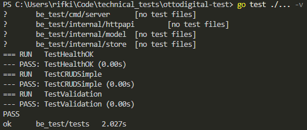

# Technical Test OttoDigital

Repository ini bertujuan untuk menampung submission technical test Fullstack Engineer OttoDigital

### Ringkasan Teknikal Sistem
- Terdapat CRUD endpoints sebagai berikut:
  - **POST /items**, Operasi penambahan satu item
  - **GET /items**, Operasi retrieval sederet item dengan jumlah yang dikembalikan
  - **GET /items/:id**, Operasi retrieval satu item berdasarkan id
  - **PUT /items/:id**, Operasi pembaruan item berdasarkan id
  - **DELETE /items/:id**, Operasi penghapusan item berdasarkan id

- Integrasi database menggunakan non-persistent simple map

### Test Summary

Semua test case telah Pass

